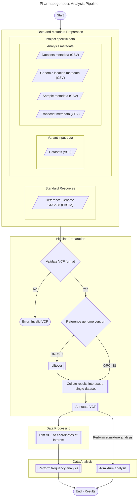

# Workflow
{: .no_toc }

A summary of the workflow itself and its analyses, broken down by topic.
{: .fs-6 .fw-300 }

Reference Genome Configuration
{: .label }

# Introduction
The <i>{{ site.title }}</i> is a pipeline powered by <a href="https://snakemake.readthedocs.io/" target="_blank">Snakemake</a>, a python-based workflow management package. This project has been created with support for PBS-Torque scheduler environments on Linux servers.

Below is a diagram representing the pipeline flow and steps in the form of a process flow diagram. For reference on the graph syntax (Shape legend), please consult [this guide](https://www.bbc.co.uk/bitesize/guides/znv3rwx/revision/2).

